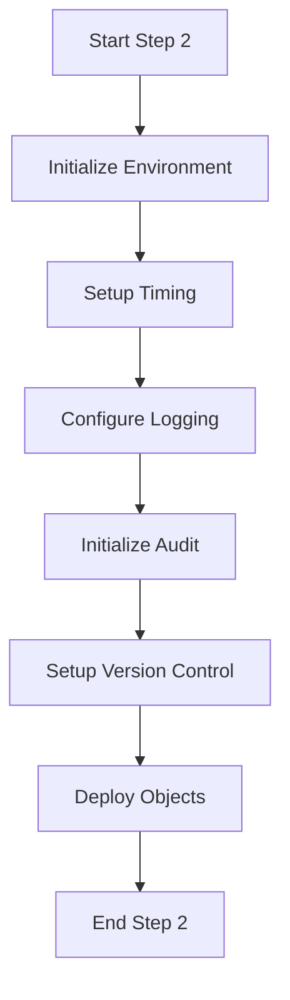

# Oasis Database Upgrade Documentation

## Overview
This documentation provides a comprehensive guide to the Oasis database upgrade process, detailing each script's functionality, dependencies, and role in the overall upgrade process.

## Master Steps
1. Step 1 (RE_Bld_Master_Step1.sql) - Database Alterations
2. Step 2 (RE_Bld_Master_Step2.sql) - PLSQL, Triggers, and Views Deployment

## Step 2 Detailed Documentation

### Core Process Scripts
The following scripts are executed as part of Step 2 of the database upgrade process. Each script serves a specific purpose in preparing, executing, and validating the upgrade.

### 1. Initialization and Setup Scripts

#### 1. RE_Bld_Init.SQL
**Purpose**: Performs initial environment setup and configuration for the build process.

**Key Functions**:
- Preserves original SQL*Plus environment settings
- Defines OS-specific commands for file operations
- Initializes step-specific temporary files
- Sets up SQL*Plus compatibility checks
- Configures spooling support

**Important Variables**:
- `OS_SLASH`, `OS_COPY`, `OS_MOVE`, `OS_DELETE`, `OS_TYPE`, `OS_READONLY`: OS-specific commands
- `SQLPLUS_COMPATIBILITY`: SQL*Plus version compatibility
- `SQLPLUS_SPOOL_APPEND_SUPPORT`: Indicates if SPOOL APPEND is supported (Y/N)

**Dependencies**:
- Requires `RE_ENV_BASE` for environment settings
- Uses `RE_Bld_Base_Env.SQL` for base environment configuration

#### 2. RE_Bld_Time_Define.SQL
**Purpose**: Establishes timing mechanisms for tracking script execution.

**Key Functions**:
- Defines time-related variables for tracking execution
- Formats current system time for logging
- Sets up timing variables for performance monitoring

**Technical Details**:
- Uses Oracle's SYSDATE for timestamp generation
- Format: 'mm/dd/yyyy hh24:mi:ss'
- Automatically restores environment settings after execution

#### 3. RE_Bld_Log_Step.SQL
**Purpose**: Configures logging mechanism for build steps.

**Key Functions**:
- Defines log file naming convention
- Sets up spooling for capturing output
- Manages log file archiving

**Log File Format**:
- Name Pattern: `Step#-yyyy.mm.dd-hh.mi.ss.log`
- Example: `Step1-2008.03.27-11.39.58.log`

**Variables**:
- `OASIS_BUILD_ARC_LOG`: Archive log name
- `OASIS_BUILD_LOG`: Current log file name
- `OASIS_BUILD_LOG_APPEND_OR_PART`: Controls log append mode

#### 4. RE_Bld_Check_Aliens_Init.SQL
**Purpose**: Establishes audit mechanisms for tracking unauthorized object changes.

**Key Components**:
1. Audit Table (`RE_BLD_AUDIT_TAB`):
   - Tracks: event_date, os_user, sys_event, object_name, object_type
   - Records all DDL operations

2. Audit Trigger (`RE_BLD_AUDIT_TRG`):
   - Captures: CREATE, DROP, ALTER events
   - Automatically logs changes to audit table

**Activation**:
- Only creates audit objects if `CHECK_ALIENS_MODE = CHECK_ALIENS_MODE_ON`
- Automatically drops and recreates audit objects if they exist

#### 5. RE_Bld_Oasis_Version.SQL
**Purpose**: Manages version control through a dedicated function.

**Key Features**:
- Creates/replaces `Get_Oasis_Version` function
- Embeds build ID in version information
- Includes copyright and generation metadata
- Supports invoker rights when `CHECK_INVRIGHTS_MODE = CHECK_INVRIGHTS_MODE_ON`

**Function Details**:
- Returns: Current Oasis version string
- Copyright: Automatically updates year
- Generation Info: Includes user, timestamp, and build ID

### 2. Build Scripts
### Build_Base_Typ.SQL
**Purpose:** Manages the creation and update of base Oracle types.
**Key Features:**
- Executes multiple type creation scripts
- Maintains type hierarchy
- Handles complex type dependencies

**Type Categories Handled:**
1. Address Types
   - AddressAdditionalInfoType
   - AddressType
   - BasicAddressType
   
2. Contact Types
   - PhoneNumberType
   - EmailType
   - ContactType

3. Organization Types
   - OrganizationType
   - OrganizationNameType
   - OrganizationLicenseType

4. Person Types
   - PersonType
   - PersonNameType
   - PersonAdditionalInfoType

**Implementation Details:**
- Consistent environment settings
- Sequential type creation
- Dependency management
- Error handling for each type

### Build_Base_Pls.SQL
**Purpose:** Executes the creation of all base PL/SQL objects including functions, procedures, and packages across different modules.

### Module Organization
1. **Claims Management (cm)**
2. **Core System (cs)**
3. **Financial Management (fm)**
4. **Policy Management (pm)**

### Build_Base_Vew.SQL (OASIS_BUILD_BASE_VEW)
**Purpose**: Creates base views for the Oasis system

### Build_Base_Trg.SQL (OASIS_BUILD_BASE_TRG)
**Purpose**: Deploys base triggers
**Categories**:
- Audit triggers
- Business logic triggers
- System maintenance triggers

### If there are Custom Object Deployment then this will be executed or skipped
#### Build_Cust_Typ.SQL (OASIS_BUILD_CUST_TYP)
**Purpose**: Deploys custom Oracle types
**Scope**:
- Customer-specific types
- Extended base types
- Custom type hierarchies

#### Build_Cust_Pls.SQL (OASIS_BUILD_CUST_PLS)
**Purpose**: Deploys custom PL/SQL objects
**Components**:
- Custom functions
- Custom procedures
- Custom packages

#### Build_Cust_Vew.SQL (OASIS_BUILD_CUST_VEW)
**Purpose**: Creates custom views
**Types**:
- Customer-specific views
- Extended base views
- Custom reporting views

#### Build_Cust_Trg.SQL (OASIS_BUILD_CUST_TRG)
**Purpose**: Deploys custom triggers
**Scope**:
- Customer-specific triggers
- Extended functionality triggers
- Custom business logic triggers

### 3.Validation Scripts
#### RE_Bld_Check_Aliens_Manager.SQL
**Purpose**: Controls the execution of alien object checks based on configuration

#### RE_Bld_Check_InvRights_Manager.SQL
**Purpose**: Manages invoker rights validation based on configuration settings

#### RE_Bld_Compile.SQL
**Purpose**: Master compilation script for database objects

### 6. Completion Scripts
#### RE_Bld_Notice_Step_End.SQL
**Purpose**: Provides formal completion notice for build steps
**Implementation Details**:
- Created: 2008.03.27
- Outputs structured completion message including:
  - Build ID
  - Step number
  - Log file location

#### RE_Bld_Time_Report.SQL
**Purpose**: Generates detailed time analysis for build steps

### Process Flow

### Notes
- This documentation will be continuously updated as we analyze each script
- Scripts will be documented in order of their execution in the upgrade process
- Dependencies and relationships between scripts will be noted
- Special configurations and parameters will be detailed